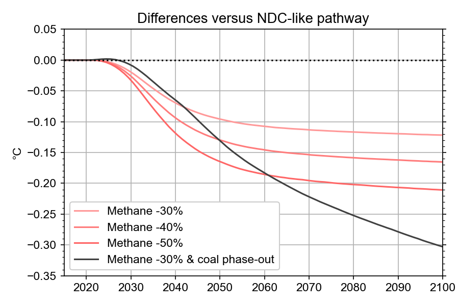

# cop26-pathways
Climate projections for near-term pathways provided for illustration for COP26.

Following the announcement of the Global Methane Pledge to reduce methane emissions by 30%, we determined the effect this would have on climate by running this scenario - plus a few other pledges (40% and 50% methane reductions) - in the IPCC AR6 calibration of the FaIR simple climate model.



## installation

### requirements
- `anaconda` for `python3`
- `python` 3.6, 3.7, 3.8 or 3.9

First, clone the repository
```
git clone https://github.com/chrisroadmap/cop26-pathways.git
```

### python and jupyter notebooks
```
cd cop26-pathways
conda env create -f environment.yml
conda activate cop26-pathways
```

If you get module import errors running any of the notebooks, it's likely that your local environment is not up to date:

```
cd cop26-pathways  # path to wherever your local copy is

# get latest version
git fetch
git pull

# update environment
conda activate cop26-pathways
conda env update -f environment.yml --prune
```

## reproduce

After activating your environment (above), start a jupyter notebook, navigate to the `notebooks` directory, and then run the notebooks in order.


## references and acknowledgements

### SSP2-4.5 MESSAGE IAM scenario data
Oliver Fricko, Petr Havlik, Joeri Rogelj, Zbigniew Klimont, Mykola Gusti, Nils Johnson, Peter Kolp, Manfred Strubegger, Hugo Valin, Markus Amann, Tatiana Ermolieva, Nicklas Forsell, Mario Herrero, Chris Heyes, Georg Kindermann, Volker Krey, David L. McCollum, Michael Obersteiner, Shonali Pachauri, Shilpa Rao, Erwin Schmid, Wolfgang Schoepp, Keywan Riahi (2017). The marker quantification of the Shared Socioeconomic Pathway 2: A middle-of-the-road scenario for the 21st century, Global Environmental Change, Volume 4, Pages 251-267, https://doi.org/10.1016/j.gloenvcha.2016.06.004

Keywan Riahi, Detlef P. van Vuuren, Elmar Kriegler, Jae Edmonds, Brian C. O’Neill, Shinichiro Fujimori, Nico Bauer, Katherine Calvin, Rob Dellink, Oliver Fricko, Wolfgang Lutz, Alexander Popp, Jesus Crespo Cuaresma, Samir KC, Marian Leimbach, Leiwen Jiang, Tom Kram, Shilpa Rao, Johannes Emmerling, Kristie Ebi, Tomoko Hasegawa, Petr Havlík, Florian Humpenöder, Lara Aleluia Da Silva, Steve Smith, Elke Stehfest, Valentina Bosetti, Jiyong Eom, David Gernaat, Toshihiko Masui, Joeri Rogelj, Jessica Strefler, Laurent Drouet, Volker Krey, Gunnar Luderer, Mathijs Harmsen, Kiyoshi Takahashi, Lavinia Baumstark, Jonathan C. Doelman, Mikiko Kainuma, Zbigniew Klimont, Giacomo Marangoni, Hermann Lotze-Campen, Michael Obersteiner, Andrzej Tabeau, Massimo Tavoni (2017). 
The Shared Socioeconomic Pathways and their energy, land use, and greenhouse gas emissions implications: An overview, Global Environmental Change, Volume 42, Pages 153-168, https://doi.org/110.1016/j.gloenvcha.2016.05.009

### RCMIP data
Zebedee Nicholls & Jared Lewis (2021). Reduced Complexity Model Intercomparison Project (RCMIP) protocol (v5.1.0) [Data set]. Zenodo. https://doi.org/10.5281/zenodo.4589756

### CEDS emissions
Patrick R. O'Rourke, Steven J. Smith, Erin E. McDuffie, Zbigniew Klimont, Monica Crippa, Andrea Mott, Shuxiao Wang, Mathhew B. Nicholson, Leyang Feng, Rachel M. Hoesly (2020). CEDS v_2021_04_21 Release Emission Data (v_2021_02_05) [Data set]. Zenodo. https://doi.org/10.5281/zenodo.4741285

### IPCC AR6 calibrations
Chris Smith (2021). FaIR v1.6.2 calibrated and constrained parameter set (v1.0) [Data set]. Zenodo. https://doi.org/10.5281/zenodo.5513022

C.J. Smith, P.M. Forster, S. Berger, W. Collins, B. Hall, D. Lunt, M.D. Palmer, M. Watanabe, M. Cain, G. Harris, N.J. Leach, M. Ringer, M. Zelinka, 2021. Figure and data generation for Chapter 7 of the IPCC's Sixth Assessment Report, Working Group 1 (plus assorted other contributions). Version 1.0. https://doi.org/10.5281/zenodo.5211357
